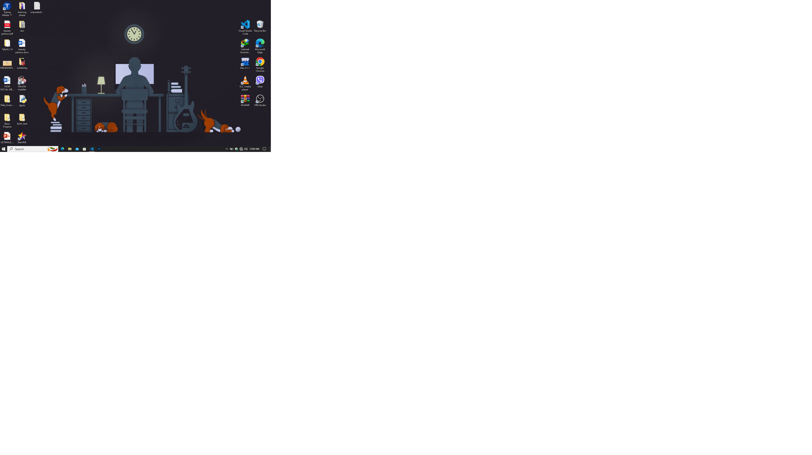

# introduction to markdown

# it is the markup language that converts text to html format.
## it is used for blogs, research paper, note,etc.
#### github flavoured markdown.
---
**for notetaking we have:** 
* bear app
* standard notes
* joplin
* obsidian.

*for blogs use ghost.*
~~mardown can be used in many places.~~

# Basic syntax for markdown
1. heading
1. use of heading
1. list

## use code block

inline: `inline code block`
multiline:
```c
/*creating hello world program*/
#include<stdio.h>
int main(){
    char name[20];
    printf("Enter your name:",name);
    scanf("%s",name);
    printf("Your name is %s",name);
    return 0;
}
```
> this is to write the quote here,bindas ma lehka yeta.
>> it gives another nested block code
>
--*Gaurav*

## why markdown?

- can be used for github
- can be used to write a proper note
- [use code block](#use-code-block)
- [easy to link page](#link-page)
## link page
suppose you want to link a text to youtube page then use

Click here to watch in [Youtube](https://youtube.com/@zerg4/) 

to add image use and add link to it
[](https://youtube.com/@zerg4/)

some text<br>some more text

## checkbox

-[X] Task 1 #1

-[X] Task 2 #2

creating table now

| name  | help | next state |
| :----- | :----- | :----- |
| green | yello | home |
| grock | machine | back |
| green | yello | home |

<details>
<summary>section head</summary>
    
section body

- heck
- man
</details>

## foot notes

happy tree are happy [^1]

## footer
[^1]:by bob ross

obsedian is must use.
md supports emoji and equations.
